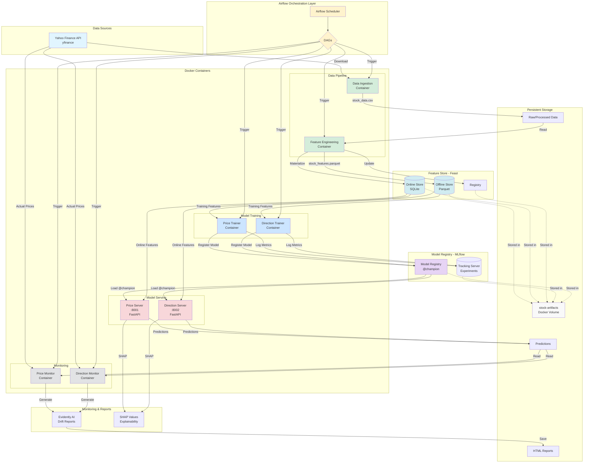

# Stock Price Prediction - End-to-End MLOps Pipeline

An end-to-end ML pipeline for stock price prediction with **Docker containerization**, **Airflow orchestration**, **feature store**, **model registry**, and **model monitoring**.

## Key Features

- **Docker**: Containerized ML pipeline with one container per model
- **Apache Airflow 3.0**: DAG-based orchestration for automated pipelines
- **Feast Feature Store**: Centralized feature management for training and serving
- **MLflow**: Model tracking, versioning, and registry
- **Evidently AI**: Data drift and model performance monitoring
- **SHAP**: Model explainability with feature importance
- **FastAPI**: REST APIs for model serving

## Models

| Model                    | Objective                      | Port |
| ------------------------ | ------------------------------ | ---- |
| **Price Regressor**      | Predict next day closing price | 8001 |
| **Direction Classifier** | Predict UP/DOWN movement       | 8002 |

## Project Structure

```
project/
├── config/
│   └── global_config.py          # Configuration with env var support
│
├── feature_store/
│   ├── feature_repo/
│   │   ├── definitions.py        # Feast feature definitions
│   │   └── feature_store.yaml    # Feast config
│   └── materialize_features.py   # Materialize to online store
│
├── pipelines/
│   ├── data_ingestion.py         # Fetch stock data
│   └── feature_engineering.py    # Create features
│
├── models/
│   ├── price_regression/
│   │   ├── config.py             # Model config
│   │   ├── train.py              # Training pipeline
│   │   ├── serve.py              # FastAPI service
│   │   ├── update_actuals.py     # Update with actual values
│   │   └── monitor.py            # Drift & performance reports
│   │
│   └── direction_classifier/
│       ├── config.py
│       ├── train.py
│       ├── serve.py
│       ├── update_actuals.py
│       └── monitor.py
│
├── docker/
│   ├── base/Dockerfile
│   ├── data-ingestion/Dockerfile
│   ├── feature-engineering/Dockerfile
│   ├── price-regression/
│   │   ├── Dockerfile.train
│   │   └── Dockerfile.serve
│   └── direction-classifier/
│       ├── Dockerfile.train
│       └── Dockerfile.serve
│
├── airflow-server/
│   ├── dags/
│   │   ├── data_pipeline_dag.py
│   │   ├── price_regression_dag.py
│   │   ├── direction_classifier_dag.py
│   │   ├── price_regression_monitor_dag.py
│   │   └── direction_classifier_monitor_dag.py
│   ├── docker-compose.yaml       # Airflow stack
│   └── .env
│
├── requirements/
│   ├── base.txt
│   ├── training.txt
│   └── serving.txt
│
├── docker-compose.yaml           # ML containers
├── .dockerignore
│
└── artifacts/                    # All generated files (gitignored)
    ├── data/
    │   ├── raw/                  # Raw stock data
    │   ├── processed/            # Processed features
    │   └── predictions/          # Model predictions
    ├── feast/                    # Feast registry & online store
    ├── mlruns/                   # MLflow runs & models
    └── reports/                  # Evidently reports
```

## Quick Start

### Option 1: Docker (Recommended)

#### Build Images

```bash
docker-compose build
```

#### Run Pipeline Manually

```bash
# Create network and volume
docker network create stock-network
docker volume create stock-artifacts

# Run pipeline
docker-compose run --rm data-ingestion
docker-compose run --rm feature-engineering
docker-compose run --rm price-trainer
docker-compose run --rm direction-trainer

# Start servers
docker-compose up -d price-server direction-server
```

#### Run with Airflow (Automated)

```bash
# Start Airflow
cd airflow-server
docker-compose up -d

# Access Airflow UI: http://localhost:8080

# Trigger DAGs manually
docker exec airflow-server-airflow-scheduler-1 airflow dags trigger data_pipeline
```

### Option 2: Local Development

#### Install Dependencies

```bash
pip install -r requirements.txt
```

#### Run Data Pipeline

```bash
python pipelines/data_ingestion.py
python pipelines/feature_engineering.py
python feature_store/materialize_features.py
```

#### Train Models

```bash
python models/price_regression/train.py
python models/direction_classifier/train.py
```

#### Serve Models

```bash
# Terminal 1
python models/price_regression/serve.py      # Port 8001

# Terminal 2
python models/direction_classifier/serve.py  # Port 8002
```

## Airflow DAGs

| DAG                            | Schedule      | Description                             |
| ------------------------------ | ------------- | --------------------------------------- |
| `data_pipeline`                | 5 AM weekdays | Data ingestion → Feature engineering    |
| `price_regression_model`       | 6 AM weekdays | Train price regression model            |
| `direction_classifier_model`   | 6 AM weekdays | Train direction classifier model        |
| `price_regression_monitor`     | 6 PM weekdays | Update actuals → Generate drift reports |
| `direction_classifier_monitor` | 6 PM weekdays | Update actuals → Generate drift reports |

### Daily Pipeline Flow

```
05:00 AM  → data_pipeline
              ├── data_ingestion
              └── feature_engineering

06:00 AM  → price_regression_model (waits for data_pipeline)
          → direction_classifier_model (waits for data_pipeline)

          → Servers make predictions throughout the day

06:00 PM  → price_regression_monitor
              ├── update_actuals
              └── run_monitor (drift reports)
          → direction_classifier_monitor
              ├── update_actuals
              └── run_monitor (drift reports)
```

## Docker Containers

| Container           | Image                     | Purpose                                     |
| ------------------- | ------------------------- | ------------------------------------------- |
| data-ingestion      | stock-data-ingestion      | Fetch stock data                            |
| feature-engineering | stock-feature-engineering | Feature engineering + Feast materialization |
| price-trainer       | stock-price-trainer       | Train price regression model                |
| direction-trainer   | stock-direction-trainer   | Train direction classifier                  |
| price-server        | stock-price-server        | Serve price predictions (port 8001)         |
| direction-server    | stock-direction-server    | Serve direction predictions (port 8002)     |

## API Endpoints

### Price Regression (Port 8001)

```bash
curl http://localhost:8001/
curl http://localhost:8001/health
curl http://localhost:8001/predict_next_close
```

### Direction Classifier (Port 8002)

```bash
curl http://localhost:8002/
curl http://localhost:8002/health
curl http://localhost:8002/predict_direction
curl http://localhost:8002/predict_direction/AAPL
```

## Architecture



### Component Interactions

**Data Pipeline:**
1. **Airflow** triggers **Data Ingestion** → Downloads from Yahoo Finance
2. **Feature Engineering** → Creates 15 technical indicators
3. **Feast Materialization** → Syncs features to online store

**Training Pipeline:**
4. Models fetch historical features from **Feast Offline Store**
5. Train **XGBoost** models (Price Regressor + Direction Classifier)
6. Log experiments to **MLflow Tracking**
7. Register best models as **@champion** in **MLflow Registry**

**Serving Pipeline:**
8. **FastAPI servers** load @champion models from MLflow
9. Fetch real-time features from **Feast Online Store**
10. Generate predictions with **SHAP explanations**
11. Return predictions via REST APIs

**Monitoring Pipeline:**
12. **Monitor scripts** fetch actual prices from Yahoo Finance
13. Compare predictions vs actuals
14. Generate **Evidently AI** drift and performance reports
15. Save HTML reports to artifacts volume

**All data persists in the `stock-artifacts` Docker volume**

## Tech Stack

| Component        | Technology         |
| ---------------- | ------------------ |
| Containerization | Docker             |
| Orchestration    | Apache Airflow 3.0 |
| Feature Store    | Feast              |
| ML Tracking      | MLflow             |
| Monitoring       | Evidently AI       |
| Explainability   | SHAP               |
| API              | FastAPI            |
| Data Source      | yfinance           |

## Stocks Tracked

- AAPL (Apple)
- GOOGL (Google)
- MSFT (Microsoft)
- AMZN (Amazon)
- TSLA (Tesla)

## Configuration

All paths and settings are in `config/global_config.py`:

- `STOCKS`: List of stock tickers to track
- `START_DATE`: Data fetch start date
- `PREDICTION_DATE`: Date for predictions
- `APP_DIR`: Base application directory (env var supported)
- `ARTIFACTS_DIR`: Base directory for all outputs (env var supported)
