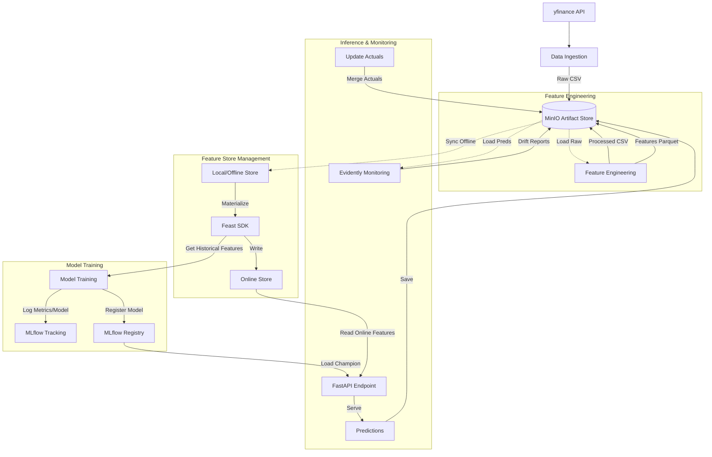

# Stock Price Prediction (End-to-End MLOps Pipeline)

An end-to-end Machine Learning pipeline for predicting stock prices using `yfinance` data, integrated with **MinIO** (Artifact Store), **Feast** (Feature Store), **MLflow** (Experiment Tracking & Registry), and **Evidently AI** (Monitoring).

## Architecture

The system uses a completely stateless design where all persistence is handled by external services (MinIO, SQLite/MLflow).



## Tech Stack
- **Data Source**: `yfinance`
- **Storage**: MinIO (S3-compatible object storage)
- **Feature Store**: Feast
- **Experiment Tracking**: MLflow (SQLite backend)
- **Model Registry**: MLflow
- **Serving**: FastAPI
- **Monitoring**: Evidently AI
- **Configuration**: Centralized `config.py`

## Setup

### 1. Prerequisites
- Docker & Docker Compose
- Python 3.10+

### 2. Security Configuration
**IMPORTANT**: This project uses environment variables for sensitive credentials.

**Create a `.env` file** in the project root with the following credentials:
   ```bash
   # MinIO Storage
   MINIO_ENDPOINT=http://localhost:9000
   MINIO_ACCESS_KEY=your_secure_access_key
   MINIO_SECRET_KEY=your_secure_secret_key
   MINIO_BUCKET_NAME=stock-prediction

   # Optional: HuggingFace token for LLM summaries
   HF_TOKEN=your_huggingface_token
   ```

**Security Features**:
- ✅ No hardcoded credentials in source code
- ✅ Environment variable validation at startup (fail-fast if missing)
- ✅ `.env` file excluded from git (add to `.gitignore`)

### 3. Infrastructure (MinIO)
Start the MinIO object storage service:
```bash
docker-compose up -d
```
This starts MinIO on ports `9000` (API) and `9001` (Console).

**Configure MinIO credentials**:
- Access MinIO Console at http://localhost:9001
- Create a new access key/secret key pair
- Add them to your `.env` file as `MINIO_ACCESS_KEY` and `MINIO_SECRET_KEY`

### 4. Environment
Install dependencies:
```bash
pip install -r requirements.txt
```

### 5. Configuration
All project settings are centralized in `config.py`. You can adjust:
- **Stocks**: List of tickers to predict.
- **Dates**: Training/Testing split ranges and target prediction dates.
- **Model Parameters**: Experiment names, tags, etc.

**Note**: Sensitive credentials (MinIO keys, API keys) are loaded from environment variables, not from `config.py`.

## Pipeline Steps

Run the pipeline steps sequentially:

1. **Data Ingestion**
   Fetches raw stock data from `yfinance` and saves to MinIO.
   ```bash
   python data_ingestion.py
   ```

2. **Feature Engineering**
   Calculates technical indicators (MA, Volatility, etc.) and saves processed data & Feast feature files to MinIO.
   ```bash
   python feature_engineering.py
   ```

3. **Feature Materialization**
   Syncs offline features to the online store for low-latency inference.
   ```bash
   python materialize_features.py
   ```

4. **Model Training**
   Trains a Random Forest model using features from Feast. Logs metrics, params, and the model artifact to MLflow. Registers the model and promotes it to `@champion` if it beats the baseline.
   ```bash
   python model_building.py
   ```

5. **Inference API**
   Starts a FastAPI server that loads the `@champion` model and serves predictions using real-time features from Feast.
   ```bash
   # Start Server
   uvicorn predict_endpoint:app --reload

   # Test Prediction
   curl http://127.0.0.1:8000/predict_next_close
   ```

6. **Update Actuals**
   (Run the following day) Fetches the actual closing price and updates the prediction records in MinIO for monitoring.
   ```bash
   python update_actuals.py
   ```

7. **Monitoring**
   Generates Data Drift and Regression Performance reports using Evidently AI and uploads them to MinIO (`reports/`).
   ```bash
   python monitoring_evidently.py
   ```

## Project Structure
```
.
├── config.py               # Central configuration
├── storage.py              # MinIO Client utility
├── data_ingestion.py       # Fetch data -> MinIO
├── feature_engineering.py  # Create features -> MinIO
├── feature_repo/           # Feast feature store definition
├── materialize_features.py # Sync features to online store
├── model_building.py       # Train & Register model
├── predict_endpoint.py     # FastAPI Inference Service
├── update_actuals.py       # Backfill actual values
├── monitoring_evidently.py # Generate reports
├── docker-compose.yaml     # MinIO infrastructure
├── requirements.txt        # Python dependencies
└── .gitignore              # Excludes .env from version control
```

## Security Best Practices

This project implements several security measures:

### 1. **Environment Variable Management**
- All sensitive credentials (MinIO keys) are stored in `.env` file
- Never commit `.env` to version control (included in `.gitignore`)
- Application fails fast at startup if required credentials are missing

### 2. **Production Hardening Checklist**
For production deployments, consider:
- [ ] Use secrets management service (AWS Secrets Manager, HashiCorp Vault)
- [ ] Enable HTTPS/TLS for API endpoints
- [ ] Implement rate limiting to prevent abuse
- [ ] Add request logging and monitoring
- [ ] Use token-based auth (JWT) instead of static API keys
- [ ] Enable CORS restrictions for web clients
- [ ] Implement role-based access control (RBAC) if multiple users
- [ ] Audit log all API access attempts

### 3. **MinIO Security**
- Change default MinIO credentials immediately
- Use IAM policies to restrict bucket access
- Enable TLS encryption for MinIO connections
- Implement bucket versioning for data recovery
