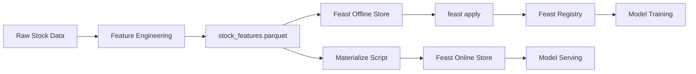

# Feature Store Module

This module manages the **Feast Feature Store** implementation for the stock prediction pipeline, enabling consistent feature engineering for both offline training and online inference.

## Overview

The feature store provides a centralized way to:
- **Define** stock market features with proper schemas
- **Store** features in both offline (Parquet) and online (SQLite) stores
- **Serve** features consistently for training and real-time predictions
- **Version** feature definitions to ensure reproducibility

## Architecture

```
feature_store/
├── feature_repo/           # Feast repository
│   ├── definitions.py      # Feature view and entity definitions
│   ├── feature_store.yaml  # Feast configuration
│   ├── registry.db         # Feature registry metadata
│   └── online_store.db     # SQLite online store for serving
├── materialize_features.py # Script to sync features to online store
└── __init__.py
```

## Components

### 1. Feature Definitions (`feature_repo/definitions.py`)

Defines the feature schema used across the pipeline:

**Entity:**
- `ticker` - Stock ticker symbol (e.g., AAPL, GOOGL)

**Features (15 total):**
- **Price Data:** Close, High, Low, Open, Volume
- **Technical Indicators:** Returns, High_Low_Pct, Close_Open_Pct
- **Moving Averages:** MA_3, MA_6, MA_8
- **Volatility:** Volatility_3, Volatility_6
- **Volume Metrics:** Volume_MA_3, Volume_Ratio

**Source:**
- File-based source pointing to `stock_features.parquet`
- Timestamp field: `Date`
- TTL: 10 years (3650 days) for historical data access

### 2. Feature Store Configuration (`feature_repo/feature_store.yaml`)

```yaml
project: stock_prediction
provider: local
registry:
  registry_type: file
  path: ../../artifacts/feast/registry.db
online_store:
  type: sqlite
  path: ../../artifacts/feast/online_store.db
offline_store:
  type: file
```

**Key Settings:**
- **Project Name:** `stock_prediction`
- **Provider:** Local (for development and containerized environments)
- **Registry:** File-based registry stored in artifacts directory
- **Online Store:** SQLite database for low-latency feature retrieval
- **Offline Store:** File-based (Parquet) for training data

### 3. Feature Materialization (`materialize_features.py`)

Script to synchronize features from the offline store (Parquet) to the online store (SQLite).

**Process:**
1. Validates that `stock_features.parquet` exists
2. Applies feature definitions to the Feast registry
3. Materializes features from the past 365 days to online store
4. Enables real-time feature serving for predictions

**Usage:**
```bash
python feature_store/materialize_features.py
```

## Integration with Pipeline

### Data Ingestion & Feature Engineering
1. `pipelines/data_ingestion.py` - Downloads stock data from yfinance
2. `pipelines/feature_engineering.py` - Creates features and saves to Parquet
   - Generates `stock_features.parquet` with UTC timestamps
   - Adds `created_timestamp` for Feast

### Model Training
Models retrieve historical features using Feast's offline store:
```python
from feast import FeatureStore
store = FeatureStore(repo_path="feature_store/feature_repo")
features = store.get_historical_features(...)
```

### Model Serving
APIs retrieve real-time features from the online store:
```python
features = store.get_online_features(
    features=FEAST_FEATURES,
    entity_rows=[{"ticker": "AAPL"}]
)
```

## Environment Variables

The feature store supports both local development and containerized environments:

- **`APP_DIR`** - Application root directory (default: project root)
- **`ARTIFACTS_DIR`** - Artifacts storage location (default: `<project>/artifacts`)

In Docker containers, these are set to:
```bash
APP_DIR=/app
ARTIFACTS_DIR=/app/artifacts
```

## Feature Store Workflow



## Commands

### Apply Feature Definitions
```bash
cd feature_store/feature_repo
feast apply
```

### Materialize Features to Online Store
```bash
python feature_store/materialize_features.py
```

### Get Feature Statistics
```bash
cd feature_store/feature_repo
feast feature-views list
feast entities list
```

## Dependencies

- **feast[redis]==0.58.0** - Feature store framework
- **pandas==2.2.3** - Data manipulation
- **numpy>=2.0.0,<2.5** - Numerical operations

See `requirements/base.txt` for complete dependencies.

## Notes

- All timestamps must be in UTC timezone for Feast compatibility
- Features are materialized for the past 365 days by default
- The online store is used for real-time predictions (< 100ms latency)
- The offline store is used for batch training and backtesting
- Feature definitions must match between offline and online stores
